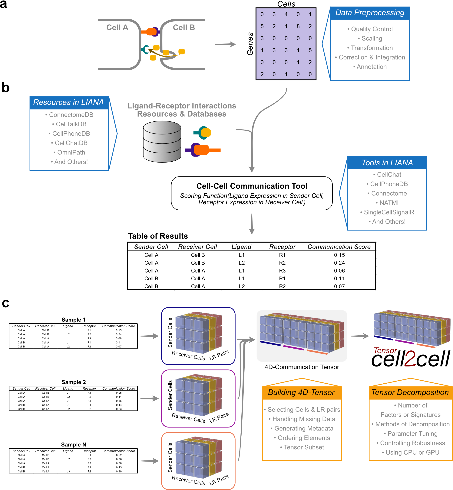

# LIANA x Tensor-Cell2cell Protocols

## Background

In recent years, the data-driven inference of cell-cell communication from single-cell transcriptomics has helped to reveal coordinated biological processes across cell types. While multiple cell-cell communication tools exist, results are specific to the tool of choice, whose underlying methods remain scattered across distinct computational frameworks. Moreover, tools are often limited to analyzing single samples or to performing pairwise comparisons. As experimental design complexity and sample numbers continue to increase in single-cell atlases, so does the need for generalizable methods to decipher cell-cell communication in such scenarios. Here, we integrate our tools, LIANA and Tensor-cell2cell, to enable the robust and flexible identification of cell-cell communication programs across multiple samples. In this protocol, we show how our unified framework facilitates the choice of method to infer cell-cell communication and subsequently perform an unsupervised deconvolution to obtain and summarize biological insights. We explain step-by-step the way that the analysis is performed in both Python and R and provide online tutorials with detailed instructions, available [TODO here]().

## Tool Availability

Tensor-cell2cell is available at:
https://github.com/earmingol/cell2cell

LIANA is available in:
- R: https://github.com/saezlab/liana
- Python: https://github.com/saezlab/liana-py

## References

To cite this work: 
TODO Baghdassarian, ...

To cite LIANA:
Dimitrov, D., Türei, D., Garrido-Rodriguez, M., Burmedi, P.L., Nagai, J.S., Boys, C., Ramirez Flores, R.O., Kim, H., Szalai, B., Costa, I.G. and Valdeolivas, A., 2022. Comparison of methods and resources for cell-cell communication inference from single-cell RNA-Seq data. Nature Communications, 13(1), p.3224.

To cite Tensor-c2c:
Armingol, E., Baghdassarian, H.M., Martino, C., Perez-Lopez, A., Aamodt, C., Knight, R. and Lewis, N.E., 2022. Context-aware deconvolution of cell–cell communication with Tensor-cell2cell. Nature communications, 13(1), p.3665.

